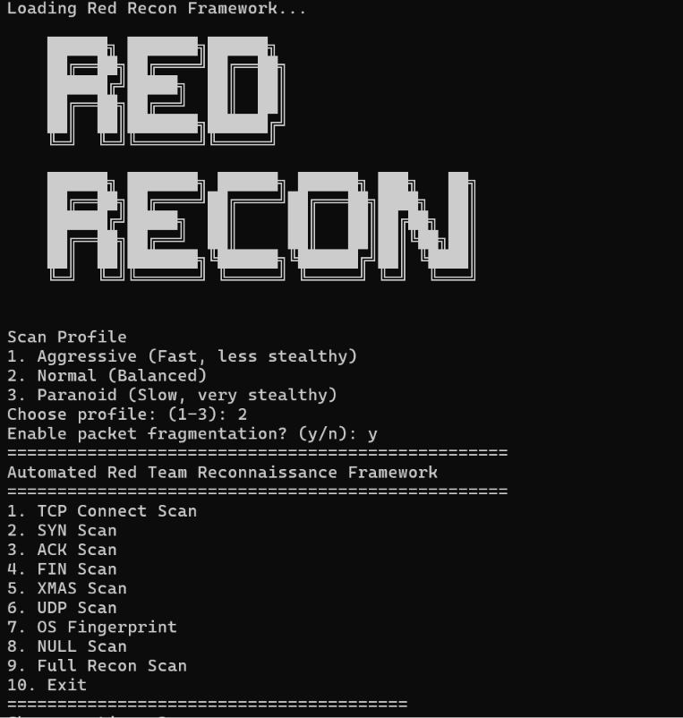
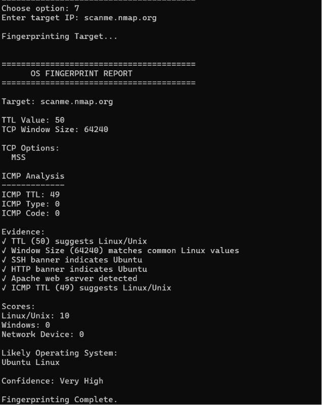
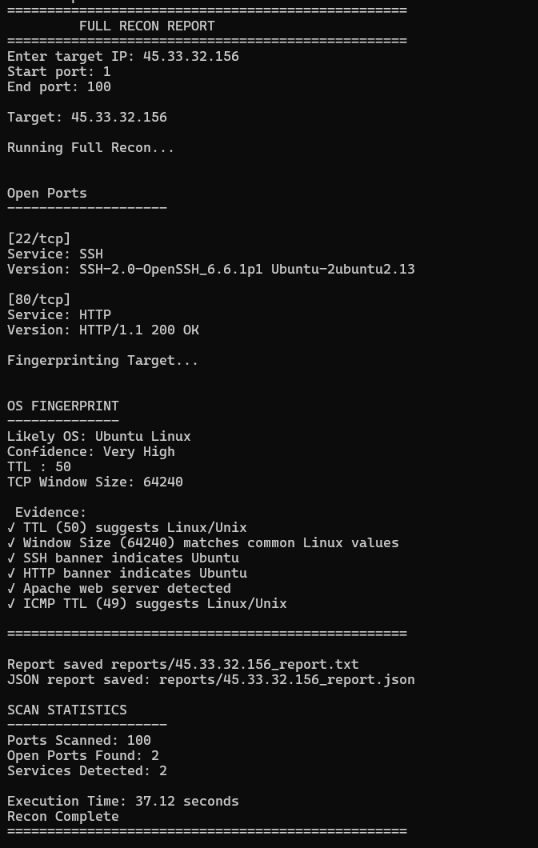
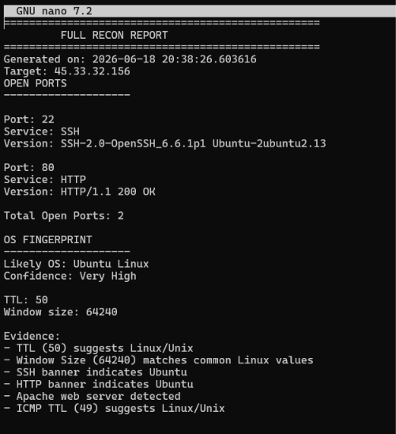
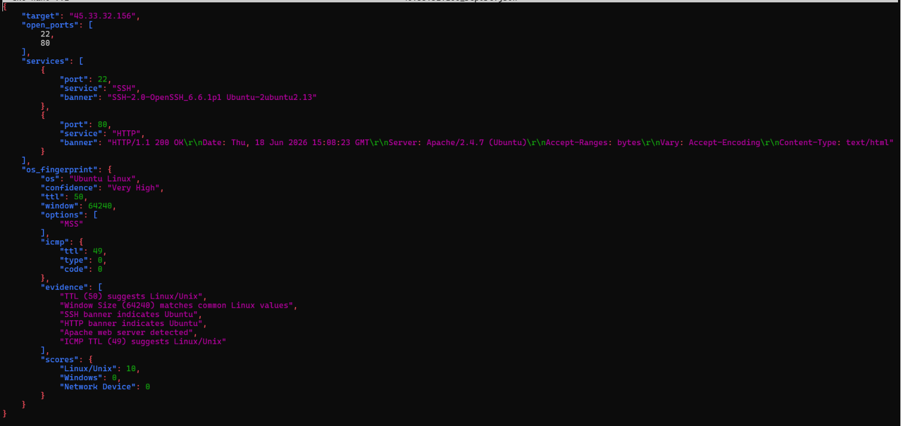

# Red Recon Framework

## Overview

Red Recon Framework is a Python-based reconnaissance and network scanning tool inspired by Nmap, Recon-ng, and the reconnaissance phase of Metasploit.

The framework demonstrates low-level network scanning, service enumeration, banner grabbing, operating system fingerprinting, and automated reconnaissance workflows using raw packet crafting with Scapy.

The project was developed to gain hands-on experience with TCP/IP networking, offensive security concepts, packet analysis, and reconnaissance methodologies.

---

## Screenshots

### Main Menu


### OS Fingerprinting


### Full Recon Scan


### TXT Report


### JSON Report


## Features

### Port Scanning

* TCP Connect Scan
* TCP SYN Scan
* TCP ACK Scan
* TCP FIN Scan
* TCP XMAS Scan
* TCP NULL Scan
* UDP Scan

### Service Enumeration

* Service Detection
* Version Detection
* Banner Grabbing

### Banner Grabbing

* Apache Version Detection
* SSH Server Enumeration
* FTP Service Detection
* HTTP Header Analysis

### Operating System Fingerprinting

The framework identifies operating systems using multiple fingerprinting techniques:

* TCP TTL Analysis
* TCP Window Size Analysis
* ICMP Response Behavior Analysis
* TCP Packet Signature Analysis
* Banner-Based Correlation
* Confidence-Based OS Classification

### Full Reconnaissance Mode

A single command workflow that:

1. Discovers open ports
2. Enumerates services
3. Detects service versions
4. Performs OS fingerprinting
5. Generates reconnaissance reports

### Reporting

* Human-readable TXT reports
* Structured JSON reports

### Stealth and Evasion Features

* Random Source Port Generation
* Scan Timing Randomization
* Multiple Stealth Scanning Techniques (FIN, NULL, XMAS)
* Packet Fragmentation Support Framework

---

## Technology Stack

* Python 3
* Scapy
* Raw Sockets
* Python Socket Programming
* Linux Networking APIs
* ThreadPoolExecutor

---
## Project Structure

```text
red-recon/
│
├── recon.py
├── README.md
├── requirements.txt
├── .gitignore
│
├── scans/
│   ├── __init__.py
│   ├── tcp_connect.py
│   ├── syn_scan.py
│   ├── ack_scan.py
│   ├── fin_scan.py
│   ├── xmas_scan.py
│   ├── null_scan.py
│   └── udp_scan.py
│
├── fingerprint/
│   ├── __init__.py
│   └── os_fingerprint.py
│
├── recon_modules/
│   ├── __init__.py
│   └── full_recon.py
│
├── utils/
│   ├── __init__.py
│   ├── banner_grabber.py
│   ├── service_enum.py
│   ├── version_detector.py
│   ├── report_generator.py
│   ├── timing.py
│   ├── evasion.py
│   └── services.py
│
├── docs/
│   └── screenshots/
│       ├── menu.png
│       ├── os_fingerprint.png
│       ├── full_recon.png
│       ├── example_text_report.png
│       └── example_json_report.png
│
└── reports/
```

### Directory Description

| Directory/File      | Purpose                                                       |
| ------------------- | ------------------------------------------------------------- |
| `recon.py`          | Main entry point and menu system                              |
| `scans/`            | All TCP and UDP scanning modules                              |
| `fingerprint/`      | Operating system fingerprinting engine                        |
| `recon_modules/`    | High-level reconnaissance workflows                           |
| `utils/`            | Helper modules for enumeration, reporting, timing and evasion |
| `docs/screenshots/` | Screenshots used in documentation                             |
| `reports/`          | Generated TXT and JSON reconnaissance reports                 |
| `requirements.txt`  | Project dependencies                                          |
| `.gitignore`        | Git ignore configuration                                      |
| `README.md`         | Project documentation                                         |

```
```
---
## Installation

Clone the repository:

```bash
git clone <repository-url>
cd red-recon
```

Install dependencies:

```bash
pip install -r requirements.txt
```

Run the framework:

```bash
sudo python3 recon.py
```

---

## Usage

Launch the framework:

```bash
sudo python3 recon.py
```

Menu:

```text
1. TCP Connect Scan
2. SYN Scan
3. ACK Scan
4. FIN Scan
5. XMAS Scan
6. UDP Scan
7. OS Fingerprint
8. NULL Scan
9. Full Recon Scan
10. Exit
```

---

## Example Full Recon Workflow

```text
Target
↓
Port Discovery
↓
Service Enumeration
↓
Version Detection
↓
OS Fingerprinting
↓
TXT Report Generation
↓
JSON Report Generation
```

---

## Sample Report Output

```text
FULL RECON REPORT

Target: 45.33.32.156

Open Ports:
22/tcp - SSH
80/tcp - HTTP

Likely OS:
Ubuntu Linux

Confidence:
Very High
```

---

## Learning Outcomes

This project demonstrates:

* TCP/IP Protocol Understanding
* Packet Crafting with Scapy
* Raw Socket Programming
* Network Reconnaissance Techniques
* Operating System Fingerprinting
* Service Enumeration
* Offensive Security Fundamentals
* Linux Networking Internals
* Practical Security Tool Development

---

## Future Enhancements

* Distributed Reconnaissance
* AI-Based Recon Pattern Detection
* Enhanced UDP Service Detection
* Web Dashboard Interface
* Multi-Target Reconnaissance
* Advanced Fingerprinting Database

---

## Disclaimer

This project is intended for educational purposes and authorized security testing only.

Always obtain proper permission before scanning or interacting with systems you do not own or administer.
